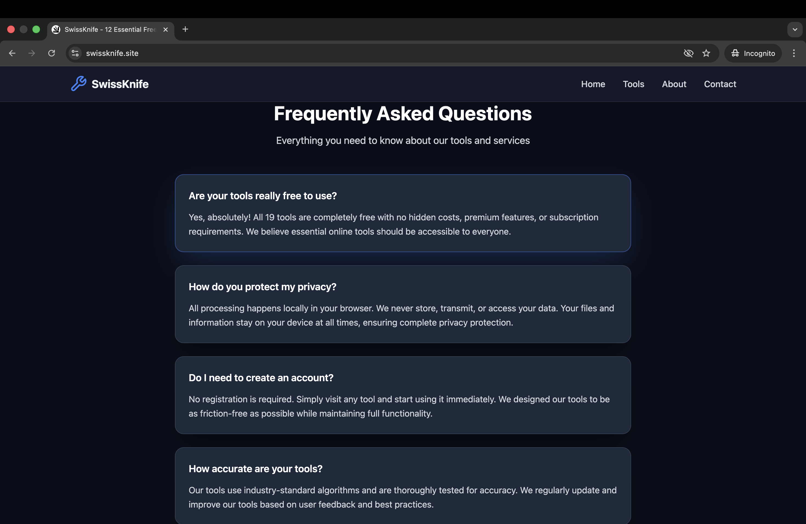

# SwissKnife - Your Essential Online Tools Suite

> **A powerful collection of free online tools for everyday tasks. Fast, secure, and beautifully designed.**

[](https://swissknife.site)
[](https://nextjs.org/)
[](https://vercel.com)

---

## Why SwissKnife?

SwissKnife is a modern, all-in-one toolbox designed to make your daily tasks easier. Whether you need to generate a secure password, create a QR code, or convert units, SwissKnife has you covered - all in one beautiful, fast, and privacy-focused application.

### Key Benefits

- **100% Free** - No hidden costs, no subscriptions
- **Privacy First** - All processing happens in your browser. Your data never leaves your device
- **Lightning Fast** - Built with Next.js for optimal performance
- **Beautiful Design** - Modern, clean interface that works on any device
- **Always Available** - Works offline as a PWA (Progressive Web App)

---

## Screenshot Gallery

### Landing Page - Modern & Engaging


### About Page - Our Story


### FAQ Section - Get Answers



### Contact Page - Reach Out


### Footer - Complete Navigation


---

## Featured Tools

### Password Generator
Generate ultra-secure passwords with customizable length, special characters, and complexity options. Perfect for keeping your accounts safe.

### QR Code Generator
Create QR codes instantly for URLs, text, contact information, and more. Download in multiple formats.

### Text Tools Suite
- Case Converter (UPPER, lower, Title Case)
- Word & Character Counter
- Text Formatter
- And more...

### Unit Converter
Convert between different units of measurement:
- Length
- Weight
- Temperature
- Volume
- And many more...

### BMI Calculator
Quick and accurate Body Mass Index calculations with health recommendations.

### Color Palette Generator
Generate beautiful, harmonious color palettes for your design projects.

**...and many more tools coming soon!**

---

## What Makes SwissKnife Special?

### Mobile-First Design
Works perfectly on smartphones, tablets, and desktops. Responsive design ensures a great experience on any screen size.

### Dark/Light Theme
Easy on the eyes, day or night. Switch between themes with a single click.

### SEO Optimized
Built with best practices for search engines, making tools easy to discover.

### No Registration Required
Jump right in and start using tools immediately. No sign-up, no login, no hassle.

### Open Source
Transparent, community-driven development. Contribute or customize to your needs.

---

## Tech Stack

Built with modern, cutting-edge technologies:

- **Framework**: Next.js 14 with App Router
- **Language**: TypeScript for full type safety
- **Styling**: Tailwind CSS for beautiful, responsive design
- **Deployment**: Vercel for instant global availability
- **Icons**: Lucide React for crisp, scalable icons

---

## Get Started

### Try It Now
Visit **[swissknife.site](https://swissknife.site)** and start using tools immediately!

### For Developers

Want to run your own instance or contribute?

1. **Clone the repository**
```bash
git clone https://github.com/yourusername/swissknife.git
cd swissknife
```

2. **Install dependencies**
```bash
npm install
```

3. **Run development server**
```bash
npm run dev
```

4. **Open your browser**
Navigate to [http://localhost:3000](http://localhost:3000)

### Deploy Your Own

Deploy to Vercel with one click or customize for your needs:

```bash
npm run build    # Build for production
npm start        # Start production server
npx vercel      # Deploy to Vercel
```

---

## Contributing

We welcome contributions from the community! Whether it's:
- Adding new tools
- Improving existing features
- Fixing bugs
- Enhancing documentation
- Suggesting new ideas

Please feel free to submit a Pull Request or open an Issue.

---

## Roadmap

Coming soon:
- Image compression & optimization tools
- JSON formatter & validator
- Base64 encoder/decoder
- Hash generators (MD5, SHA)
- And much more...

---

## License

This project is open source and available under the [MIT License](LICENSE).

---

## Contact & Support

- **Website**: [swissknife.site](https://swissknife.site)
- **Issues**: [GitHub Issues](https://github.com/yourusername/swissknife/issues)
- **Contributions**: [Pull Requests Welcome](https://github.com/yourusername/swissknife/pulls)

---

<p align="center">Made with ❤️ for the community</p>
<p align="center">⭐ Star us on GitHub if you find SwissKnife useful!</p>
